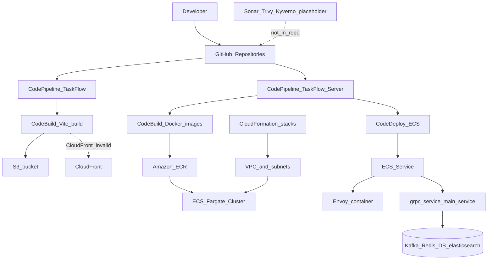
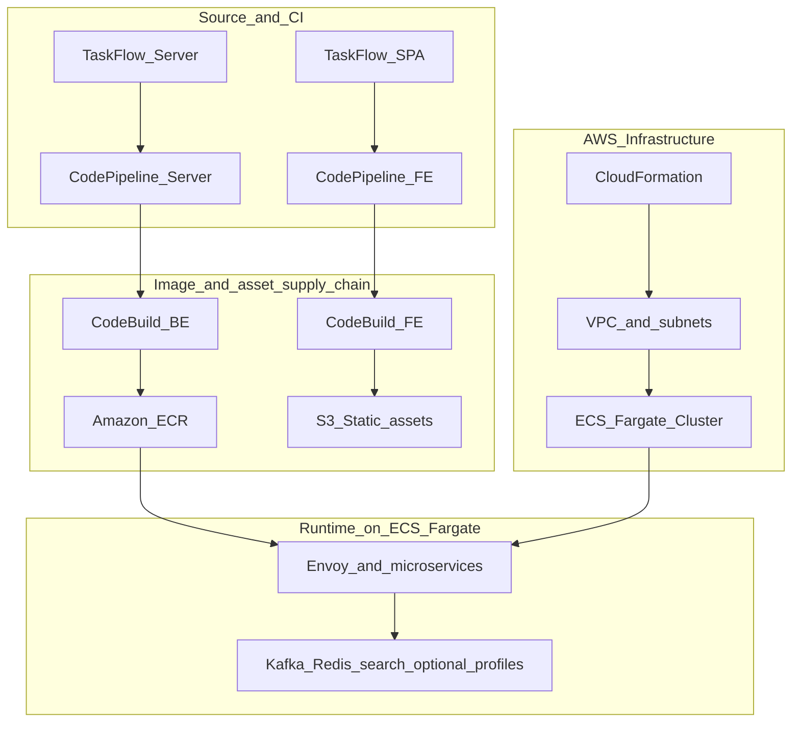
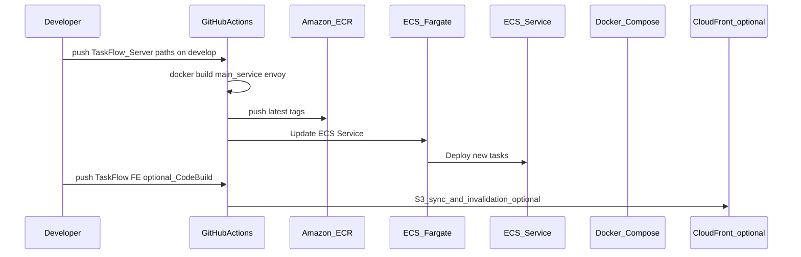

# TaskFlow AWS Microservices DevSecOps Platform


Shields above sketch a full DevSecOps toolchain; **what this monorepo implements today** is primarily **AWS CloudFormation (VPC + ECS)**, **ECS Fargate**, **Amazon ECR**, **AWS CodePipeline & CodeBuild** for backend image builds and ECS redeploy via **CodeDeploy**. **TaskFlow-Server** targets **.NET 10** (`Project Sdk="Microsoft.NET.Sdk.Web"` → `net10.0`), not .NET 9 as on the badge line.

This workspace combines the **TaskFlow** React/Vite SPA with **TaskFlow-Server**, a polyglot backend (ASP.NET Core **main-service**, NestJS **notification-service**, **Envoy** API gateway, Kafka, Redis, Elasticsearch/Kibana and related dependencies via Compose). The goal is not only to run the product but to document how builds reach AWS.


Placeholders: export `image.png` from [TaskFlow-Server/DIAGRAM.drawio](TaskFlow-Server/DIAGRAM.drawio) or add your own screenshot at the repo root.

## Table of Contents

- [Learning Objectives](#learning-objectives)
- [Architecture](#architecture)
- [Platform Layers](#platform-layers)
- [Folder Responsibility](#folder-responsibility)
- [Repository Structure](#repository-structure)
- [Current CI/CD Flow](#current-cicd-flow)
- [GitOps Runtime Flow](#gitops-runtime-flow)
- [Prerequisites](#prerequisites)
- [Run Locally](#run-locally)
- [Security Stack Setup](#security-stack-setup)
- [ECS Deployment Setup](#ecs-deployment-setup)
- [AWS Pipeline Configuration](#aws-pipeline-configuration)
- [ECR, EKS, and Argo CD Setup](#ecr-eks-and-argo-cd-setup)
- [Pipeline Readiness Checklist](#pipeline-readiness-checklist)
- [Troubleshooting](#troubleshooting)
- [Documentation Index](#documentation-index)

## Learning Objectives

By walking through this repository, you should be able to explain and operate:

| Area | What this project demonstrates |
|---|---|
| Infrastructure as Code | Nested **AWS CloudFormation** stacks under `cloud-infrastructure/` for VPC subnets and an EC2 backend host with Docker bootstrap user data. |
| CI/CD | **AWS CodePipeline** triggers on source changes, uses **CodeBuild** to build `main-service` and Envoy images, pushes to **ECR**, then updates the **ECS Fargate** service via **CodeDeploy**. Another pipeline handles SPA publish to **S3** / **CloudFront**. |
| GitOps | Not Argo CD here: deployment **desired state** is **ECS task definitions + images** on ECS Fargate; Git pushes trigger CI only when workflows live at the Git repo root (see caveat below). |
| Kubernetes runtime | Not used in this repo; runtime orchestration is **ECS Fargate**. |
| Supply chain security | **ECR** as registry; workflow tags **`latest`** today (immutable digest tags can be adopted separately). Nexus/Trivy/Sonar artifacts are **not** wired in-tree. |
| Cluster security | ECS security groups and IAM policies from CloudFormation; no Kyverno/Falco manifests in this workspace. |
| Observability | Envoy routing and dependency logs inside Compose; Prometheus/Grafana stacks are **not** configured here beyond badge references. |

## Architecture



## Platform Layers



High-level idea:

- **AWS CodePipeline** triggers when paths change under `TaskFlow-Server`, using **CodeBuild** to build and push backend images to **ECR**.
- The pipeline then uses **CodeDeploy** to update the **ECS Fargate** service and roll out new images.
- **CloudFormation** provisions networking and the ECS Fargate cluster.
- Frontend Pipeline on **`develop`** uses **CodeBuild** (`TaskFlow/buildspec.yml`) to publish SPA to S3 and invalidate CloudFront.

## Folder Responsibility

This workspace separates SPA source, backend services, IaC templates, and optional load tooling:

```text
TaskFlow/              = React/Vite SPA (pnpm), FE CodeBuild spec
TaskFlow-Server/       = Envoy + microservices + protos + Compose + BE CodeBuild spec, appspec.yml
cloud-infrastructure/  = CloudFormation root/nested stacks (+ optional ECS scheduler Lambda YAML)
TaskFlowTesting/       = k6 load tests (small harness)
```

Examples:

| Path | Role |
|---|---|
| `TaskFlow-Server/docker-compose.yml` | Local/dev Compose definitions and profiles (`grpc_service`, `notification_service`, `kafka`, `redis`, `elasticsearch`, …). |
| `TaskFlow-Server/docker-compose.prod.yml` | Production overrides: pull **`envoy-proxy`** and **`main-service`** images from **`${ECR_REGISTRY}`**. |
| `TaskFlow-Server/buildspec.yml` | Build/push **`main-service`** and **`envoy-proxy`** to ECR; used by CodePipeline. |
| `TaskFlow-Server/appspec.yaml` | AWS CodeDeploy configuration for ECS Fargate rollout. |
| `TaskFlow/buildspec.yml` | Example CodeBuild pipeline: **`pnpm build`**, **`aws s3 sync`** to **`frontend.taskkfloww.shop`**, CloudFront invalidation **E2RGM9XABY19D9**. |
| `cloud-infrastructure/root.yaml` | Root stack composing networking + compute nested stacks. |

In short:

```text
TaskFlow/             = SPA client
TaskFlow-Server/      = API gateway + services + containers + backend CI/CD
cloud-infrastructure/ = VPC + ECS Fargate (+ optional ECS scheduler templates)
```

## Repository Structure

```text
.
|-- TaskFlow/                       # React/Vite SPA (pnpm)
|-- TaskFlow-Server/                # Envoy, main-service (.NET), Nest notification-service, protos, Compose
|   |-- services/main-service/      # ASP.NET Core main-service Dockerfile build context root ..
|   |-- services/nest-service/      # NestJS notification-service
|   |-- protos/                     # gRPC/protobuf definitions shared with main-service
|   |-- envoy.yaml                  # Envoy routing config (wired into envoy image build)
|   |-- dockerfile                  # Envoy proxy image build at repo root
|   |-- docker-compose.yml          # Dev compose + profiles
|   |-- docker-compose.prod.yml     # Prod overrides (ECR images)
|   |-- buildspec.yml               # CodeBuild ECR workflow helper scripts
|   |-- appspec.yaml                # AWS CodeDeploy configuration
|   `-- DIAGRAM.drawio              # Architecture diagram source (export for ./image.png)
|-- cloud-infrastructure/           # CloudFormation templates (VPC, ECS, ALB/messaging stubs, ECS Lambda schedules)
|-- TaskFlowTesting/                # k6 tests
`-- TaskFlow/buildspec.yml          # SPA CodeBuild → S3 / CloudFront (project-specific bucket & distribution IDs)
```

Key operational files:

| File | Purpose |
|---|---|
| `TaskFlow-Server/buildspec.yml` | CodeBuild configuration to build/push **`main-service`** and **`envoy-proxy`** (`latest`) to ECR. |
| `TaskFlow-Server/appspec.yaml` | AWS CodeDeploy instructions for ECS Fargate deployments. |
| `TaskFlow-Server/services/main-service/Dockerfile` | Multi-stage build for **`main-service`** image (context is **`TaskFlow-Server`** root). |
| `TaskFlow-Server/dockerfile` | Envoy image built from **`envoy.yaml`**. |
| `TaskFlow/buildspec.yml` | CodeBuild configuration to publish SPA to S3 / CloudFront. |
| `cloud-infrastructure/root.yaml` | Orchestrates **`networking.yaml`** then **`compute.yaml`**. |

## Current CI/CD Flow

**AWS CodePipeline** monitors the GitHub repository and triggers when changes are merged to:

```text
develop
```

Main flow (**TaskFlow-Server**):

1. **Source**: CodePipeline fetches the latest source from GitHub.
2. **Build**: CodeBuild uses **`TaskFlow-Server/buildspec.yml`** to build the **`main-service`** and **`envoy`** container images and pushes them to **Amazon ECR**.
3. **Deploy**: CodeDeploy uses the generated `imagedefinitions.json` and **`appspec.yaml`** to perform a rolling update or blue/green deployment to the **ECS Fargate** service.

Frontend (**TaskFlow**):

- CodePipeline triggers a separate CodeBuild project using **`TaskFlow/buildspec.yml`** to run **`pnpm install`** and **`pnpm run build`**.
- It then publishes **`dist/`** to **`s3://frontend.taskkfloww.shop`** and invalidates CloudFront **`E2RGM9XABY19D9`** (adjust ARNs/names if your account differs).

## GitOps Runtime Flow



## Prerequisites

Local workstation:

- Git
- Docker and Docker Compose plugin
- **pnpm** (frontend)
- Node.js **22+** (frontend CI tests **22.x** and **24.x**)
- **.NET SDK 10** (for **`main-service`** outside containers — matches **`TargetFramework`** `net10.0`)
- Optional: Go tooling if you extend **`metrics-service`**
- AWS CLI v2 (deploy/templates and ECR checks)

AWS:

- AWS account with permissions for **CloudFormation**, **ECR**, **ECS**, **IAM**, **VPC**.
- ECR repositories used by workflows/spec comments:
  - **`main-service`**
  - **`envoy-proxy`**
  - **`notification-service`** (referenced by **`TaskFlow-Server/buildspec.yml`** comments when using CodeBuild)

Git repository layout caveat:

- When configuring **AWS CodePipeline**, ensure your source action correctly filters for paths within **`TaskFlow-Server/`** and **`TaskFlow/`** to trigger the respective backend and frontend pipelines effectively.

## Run Locally

### Frontend (`TaskFlow/`)

```bash
cd TaskFlow
pnpm install
pnpm run dev
```

Default dev server is Vite (**often `http://localhost:5173`** — confirm from CLI output).

### Backend (`TaskFlow-Server/`)

Use Compose **profiles** from [TaskFlow-Server/docker-compose.yml](TaskFlow-Server/docker-compose.yml). Typical combinations depend on what you need (gRPC API, notifications, Kafka, Redis, Elasticsearch). Service ports and responsibilities are summarized in [TaskFlow-Server/README.md](TaskFlow-Server/README.md).

Example shape (adjust profiles and env files to match your setup):

```bash
cd TaskFlow-Server
docker compose --profile grpc_service --profile kafka --profile redis up --build
```

Env files such as **`.env`** / **`.env.dev`** are documented alongside the server README; **do not commit secrets**.

## Security Stack Setup

No bundled Nexus/Sonar/Trivy Compose ships with this umbrella README path. Treat security posture as:

| Topic | Guidance |
|---|---|
| CI secrets | Store sensitive environment variables like **`REDIS_CONNECTIONSTRING`** securely in **AWS Systems Manager Parameter Store** or **Secrets Manager** and reference them in your CodeBuild `buildspec.yml`. |
| Runtime secrets | Inject secrets securely into ECS tasks via AWS Secrets Manager or Parameter Store. |
| Keys | Prefer **IAM Task Execution roles** on ECS instead of long-lived access keys where possible. Never commit **`*.csv`** access key bundles or checked-in `.env` with production passwords. |

Optional future alignment with the badges (Sonar/Trivy/Kyverno/Falco) would live outside this repo unless you add manifests later.

## ECS Deployment Setup

**AWS CodeDeploy** interacts with AWS ECS APIs to deploy new container images to Fargate tasks. Ensure that your CodeDeploy Service Role has the necessary permissions to update ECS services and task definitions.

Your ECS cluster and services should be provisioned via the `cloud-infrastructure` CloudFormation templates.

## AWS Pipeline Configuration

Configure the required environment variables in your **AWS CodeBuild** projects:

Required Environment Variables:

| Variable | Purpose |
|---|---|
| `AWS_REGION` | Region for ECR login and deployments. |
| `REDIS_CONNECTIONSTRING` | Passed into **`main-service`** Docker build as **`REDIS_CONNECTIONSTRING`** build-arg (store securely in Parameter Store). |
| `ECS_CLUSTER` | Name of the target ECS Cluster. |
| `ECS_SERVICE` | Name of the target ECS Service. |

Your CodeBuild Service Role will require permissions to access ECR, ECS, and any referenced Parameter Store secrets.

## ECR, EKS, and Argo CD Setup

This project **does not use EKS or Argo CD** today; backend rollout uses **ECR images + ECS Fargate**. CloudFormation templates live under **`cloud-infrastructure/`**.

### CloudFormation

Package/deploy nested stacks from **`cloud-infrastructure/`** (adjust bucket/prefix and capabilities for your account):

```bash
cd cloud-infrastructure
aws cloudformation deploy \
  --stack-name taskflow-root \
  --template-file root.yaml \
  --capabilities CAPABILITY_NAMED_IAM
```

Templates reference **`networking.yaml`** and **`compute.yaml`** via **`TemplateURL`** (upload nested templates to S3 in real deployments if required by your packaging workflow).

### ECR repositories

Create repositories if missing (region example **`ap-southeast-1`** from **`TaskFlow-Server/buildspec.yml`** comments — replace with **`AWS_REGION`**):

```bash
aws ecr create-repository --repository-name main-service --region "$AWS_REGION"
aws ecr create-repository --repository-name envoy-proxy --region "$AWS_REGION"
aws ecr create-repository --repository-name notification-service --region "$AWS_REGION"
```

### ECS Fargate runtime

Your ECS tasks will automatically pull the latest images from ECR based on the task definitions.

Ensure your task definitions or AWS Secrets Manager provide the credentials expected by **`main-service`** / **`notification-service`** images per environment docs.

### Frontend static hosting (optional CodeBuild path)

When using **`TaskFlow/buildspec.yml`**, configure CodeBuild IAM for **`s3:PutObject`** / **`cloudfront:CreateInvalidation`** on the documented bucket/distribution IDs.

## Pipeline Readiness Checklist

Before relying on the **CodePipeline**:

- ECS Cluster and Service are active and healthy.
- Task Execution Role has permissions to pull from **`main-service`** / **`envoy-proxy`** repos.
- Repositories **`main-service`** and **`envoy-proxy`** exist in **`AWS_REGION`**.
- CodeBuild and CodeDeploy roles have the appropriate permissions.
- CodePipeline source stage is correctly connected to the GitHub repository branch.

For SPA CodeBuild (**`TaskFlow/buildspec.yml`**):

- IAM allows **`aws s3 sync`** on **`frontend.taskkfloww.shop`** and CloudFront invalidation **E2RGM9XABY19D9** (or updated IDs).

## Troubleshooting

| Symptom | Common cause | Fix |
|---|---|---|
| ECS Task fails to start | Image pull error | Verify Task Execution Role permissions for ECR and check image URIs. |
| CodePipeline doesn't trigger | Webhook missing or wrong branch | Verify the GitHub connection and webhook configuration in AWS CodePipeline. |
| CodeBuild fails to push to ECR | Missing IAM permissions | Verify the CodeBuild Service Role has `ecr:GetAuthorizationToken`, `ecr:BatchCheckLayerAvailability`, `ecr:CompleteLayerUpload`, `ecr:InitiateLayerUpload`, `ecr:PutImage`, `ecr:UploadLayerPart`. |
| CodeDeploy fails to update ECS | Missing appspec or IAM issues | Ensure `appspec.yaml` exists and CodeDeploy Service Role has ECS permissions. |
| **`grpc-service`** unhealthy | Missing infra profiles (.env / Kafka / Redis) | Start needed Compose profiles or validate ECS Task Definitions. |
| Frontend CodeBuild denied | IAM lacking S3/CloudFront | Extend CodeBuild role per **`TaskFlow/buildspec.yml`** header comments. |

## Security Practices Used

- Do **not** commit **AWS access key CSV files**, production `.env`, or private SSH keys.
- Prefer IAM Task Execution Roles on ECS over embedding **`AWS_ACCESS_KEY_ID`** inside images where feasible.
- Envoy admin **`9901`** is intentionally **not** exposed in **`docker-compose.prod.yml`** comments — keep admin ports internal only.

## Documentation Index

| Document | Content |
|---|---|
| [TaskFlow/README.md](TaskFlow/README.md) | SPA toolchain notes (Vite template README). |
| [TaskFlow-Server/README.md](TaskFlow-Server/README.md) | Service ports, tech stack, Compose-oriented overview. |
| [TaskFlow-Server/services/nest-service/README.md](TaskFlow-Server/services/nest-service/README.md) | NestJS notification-service docs. |

## Expected Result

When **`TaskFlow-Server`** CodePipeline succeeds after a qualifying **`develop`** push:

```text
Source_code -> CodeBuild_images -> ECR_push_latest -> CodeDeploy_ECS -> running Envoy_and_grpc_service
```

Final validation commands (examples):

```bash
aws ecs describe-services --cluster "$ECS_CLUSTER" --services "$ECS_SERVICE"
aws ecr describe-images --repository-name main-service --region "$AWS_REGION"
aws ecr describe-images --repository-name envoy-proxy --region "$AWS_REGION"
```

Optional SPA validation after **`TaskFlow/buildspec.yml`** pipeline:

```bash
aws cloudfront get-invalidation --distribution-id E2RGM9XABY19D9 --id "<invalidation-id>"
```
